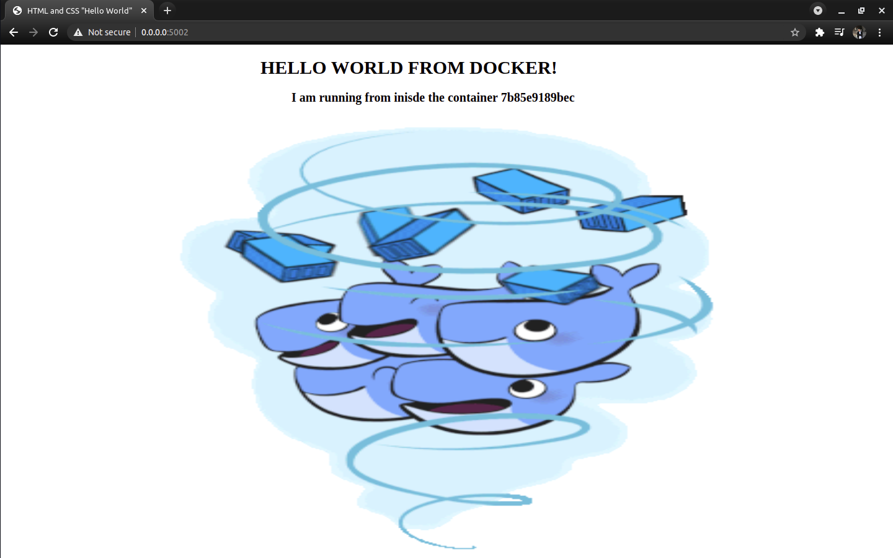
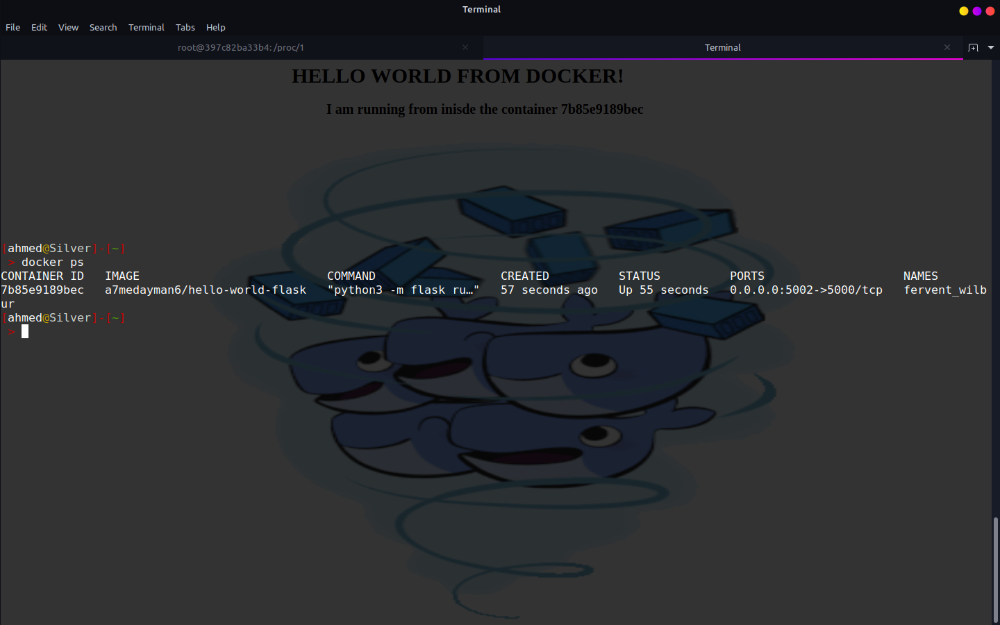

# Hello World From Container! - Flask Web App

### Demo App to practice Docker 

## BUILD

```BASH
git clone .
cd Hello-World-From-Container
docker build -t hello-world:latest .
docker run -p 5001:5000 hello-world 
# visit http:/0.0.0.0:5001 to see the web site presnting the container id it's running from!
```

## Or pull it from docker hub!
```BASH
docker pull a7medayman6/hello-world-flask
docker run -p 5001:5000 hello-world-flask
# visit http:/0.0.0.0:5001 to see the web site presnting the container id it's running from!
```

## Preview



### Same Container name!
